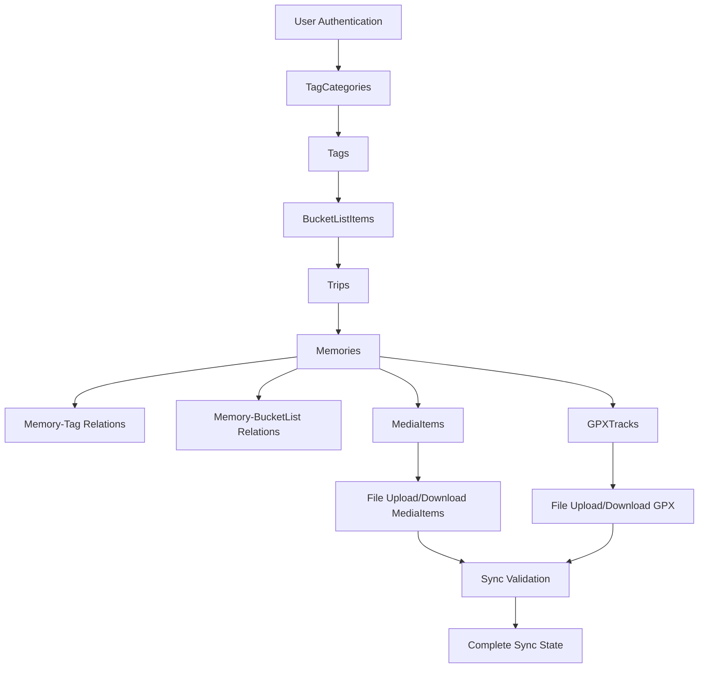

# Vollständige Synchronisations-Architektur

## Übersicht

Dieses Dokument beschreibt die Architektur für die vollständige Synchronisation aller Journiary-Daten zwischen mehreren iOS-Geräten über das selbst gehostete Backend. Ziel ist es, dass eine auf einem Gerät erstellte Memory mit allen Komponenten (Fotos, GPX-Tracks, Tags, GPS-Position, Erstellungsdatum, etc.) exakt identisch auf einem zweiten Gerät angezeigt wird.

## Aktuelle Problemanalyse

### Identifizierte Schwachstellen:
1. **Beziehungsauflösung**: Memory-Photo vs. Memory-MediaItem Duplikate
2. **Datenintegrität**: Inkonsistente Sync-Status zwischen verwandten Entitäten
3. **Reihenfolge**: Fehlende Dependency-Auflösung bei der Synchronisation
4. **Dateihandling**: Asynchrone File-Sync kann zu inkonsistenten Zuständen führen
5. **Legacy-Kompatibilität**: Photo-Entitäten neben MediaItem-Entitäten

## Zielarchitektur

### 1. Datenmodell-Harmonisierung

```
Server (PostgreSQL)                    iOS (Core Data)
┌─────────────────┐                   ┌─────────────────┐
│ Trip            │◄──────────────────┤ Trip            │
│ ├─ id           │                   │ ├─ id           │
│ ├─ serverId     │                   │ ├─ serverId     │
│ ├─ name         │                   │ ├─ name         │
│ ├─ isActive     │                   │ ├─ isActive     │
│ └─ memories[]   │                   │ └─ memories[]   │
└─────────────────┘                   └─────────────────┘
        │                                     │
        ▼                                     ▼
┌─────────────────┐                   ┌─────────────────┐
│ Memory          │◄──────────────────┤ Memory          │
│ ├─ id           │                   │ ├─ serverId     │
│ ├─ title        │                   │ ├─ title        │
│ ├─ text         │                   │ ├─ text         │
│ ├─ timestamp    │                   │ ├─ timestamp    │
│ ├─ latitude     │                   │ ├─ latitude     │
│ ├─ longitude    │                   │ ├─ longitude    │
│ ├─ locationName │                   │ ├─ locationName │
│ ├─ weatherJSON  │                   │ ├─ weatherJSON  │
│ ├─ mediaItems[] │                   │ ├─ mediaItems[] │
│ ├─ gpxTrack     │                   │ ├─ gpxTrack     │
│ ├─ tags[]       │                   │ ├─ tags[]       │
│ └─ bucketItem   │                   │ └─ bucketItem   │
└─────────────────┘                   └─────────────────┘
        │                                     │
   ┌────┼─────────┐                    ┌─────┼─────────┐
   ▼    ▼         ▼                    ▼     ▼         ▼
┌─────┐┌─────┐┌─────────┐         ┌─────┐┌─────┐┌──────────┐
│Media││GPX  ││Tags[]   │         │Media││GPX  ││Tags[]    │
│Item ││Track││         │  ◄──────┤Item ││Track││          │
└─────┘└─────┘└─────────┘         └─────┘└─────┘└──────────┘
```

### 2. Sync-Dependency-Graph



### 3. Datenfluss-Architektur

#### Phase 1: Metadaten-Synchronisation (Atomic)
```
Upload-Reihenfolge:
TagCategories → Tags → BucketListItems → Trips → Memories → MediaItem-Metadaten → GPXTrack-Metadaten

Download-Reihenfolge:
TagCategories → Tags → BucketListItems → Trips → Memories → Beziehungen → MediaItems → GPXTracks
```

#### Phase 2: Datei-Synchronisation (Async)
```
Parallel-Upload:
├─ MediaItem-Dateien (Fotos/Videos)
├─ MediaItem-Thumbnails
└─ GPXTrack-Dateien

Parallel-Download:
├─ Hochprioritäts-Dateien (neue Medien)
├─ Mediumprioritäts-Dateien (Thumbnails)
└─ Niedrigprioritäts-Dateien (alte/große Dateien)
```

#### Phase 3: Konsistenz-Validation
```
Validierungs-Checks:
├─ Referenz-Integrität (Memory → Trip, MediaItem → Memory)
├─ Orphaned Objects Detection
├─ Sync-Status Konsistenz
├─ Datei-Referenzen Validation
└─ Beziehungs-Vollständigkeit
```

## Core-Komponenten-Architektur

### 1. Enhanced SyncManager
```swift
final class CompleteSyncManager {
    // Dependency-Resolver für korrekte Sync-Reihenfolge
    private let dependencyResolver: SyncDependencyResolver
    
    // Transaktions-Manager für atomare Operationen
    private let transactionManager: SyncTransactionManager
    
    // Konsistenz-Validator
    private let consistencyValidator: SyncConsistencyValidator
    
    // Intelligenter File-Sync-Manager
    private let fileSyncManager: IntelligentFileSyncManager
    
    // Conflict-Resolution-Engine
    private let conflictResolver: ConflictResolutionEngine
}
```

### 2. Sync-Status-Management
```swift
enum DetailedSyncStatus: String, CaseIterable {
    case localOnly = "local_only"           // Nur lokal, noch nie synchronisiert
    case needsUpload = "needs_upload"       // Lokale Änderungen warten auf Upload
    case uploading = "uploading"            // Gerade im Upload-Prozess
    case needsDownload = "needs_download"   // Server-Änderungen warten auf Download
    case downloading = "downloading"        // Gerade im Download-Prozess
    case inSync = "in_sync"                // Vollständig synchronisiert
    case conflict = "conflict"              // Konflikt erkannt, Benutzereingriff nötig
    case syncError = "sync_error"           // Sync-Fehler aufgetreten
    case filesPending = "files_pending"     // Metadaten sync, Dateien noch ausstehend
}
```

### 3. Beziehungs-Synchronisation
```swift
protocol RelationshipSyncProtocol {
    func syncRelationships<T: Synchronizable>(
        for entity: T,
        remoteRelations: [String],
        localContext: NSManagedObjectContext
    ) async throws
}

class MemoryRelationshipSync: RelationshipSyncProtocol {
    func syncMemoryTags(_ memory: Memory, remoteTagIds: [String]) async throws
    func syncMemoryBucketItem(_ memory: Memory, remoteBucketId: String?) async throws
    func syncMemoryMediaItems(_ memory: Memory, remoteMediaIds: [String]) async throws
    func syncMemoryGPXTrack(_ memory: Memory, remoteGPXId: String?) async throws
}
```

## Datei-Synchronisation-Architektur

### 1. Intelligente Priorisierung
```
Priorität 1 (Sofort):
- Neue MediaItem-Thumbnails
- Kleine Dateien (< 1MB)
- Aktuell angezeigte Memories

Priorität 2 (Normal):
- MediaItem-Vollauflösung
- GPXTrack-Dateien
- Nicht-aktuelle Memories

Priorität 3 (Hintergrund):
- Alte/Archivierte Medien
- Backup-Kopien
- Cache-Optimierungen
```

### 2. Retry-Mechanismus
```swift
struct FileTransferRetryPolicy {
    let maxRetries: Int = 3
    let baseDelay: TimeInterval = 1.0
    let maxDelay: TimeInterval = 30.0
    let backoffMultiplier: Double = 2.0
    
    func delay(for attempt: Int) -> TimeInterval {
        let delay = baseDelay * pow(backoffMultiplier, Double(attempt))
        return min(delay, maxDelay)
    }
}
```

### 3. Batch-Optimierung
```swift
struct OptimalBatchConfiguration {
    let networkQuality: NetworkQuality
    let batchSize: Int
    let concurrency: Int
    
    static func calculate(for network: NetworkQuality) -> OptimalBatchConfiguration {
        switch network {
        case .excellent: return OptimalBatchConfiguration(networkQuality: .excellent, batchSize: 20, concurrency: 4)
        case .good: return OptimalBatchConfiguration(networkQuality: .good, batchSize: 10, concurrency: 3)
        case .fair: return OptimalBatchConfiguration(networkQuality: .fair, batchSize: 5, concurrency: 2)
        case .poor: return OptimalBatchConfiguration(networkQuality: .poor, batchSize: 2, concurrency: 1)
        }
    }
}
```

## Conflict Resolution

### 1. Erweiterte Last-Write-Wins-Strategie
```swift
struct ConflictResolutionStrategy {
    enum ResolutionType {
        case lastWriteWins           // Standard: Neuerer Timestamp gewinnt
        case userChoice              // Benutzer entscheidet manuell
        case mergeCompatible         // Automatisches Merging bei kompatiblen Änderungen
        case fieldSpecific           // Pro-Feld-Entscheidung bei komplexen Objekten
    }
    
    func resolve<T: Synchronizable>(
        local: T, 
        remote: T,
        conflictType: ConflictType
    ) async throws -> T
}
```

### 2. Merge-Regeln für Memory-Objekte
```swift
struct MemoryMergeRules {
    // Titel: Längere Version gewinnt (mehr Information)
    static func mergeTitle(local: String?, remote: String?) -> String?
    
    // Text: Intelligente Text-Merger
    static func mergeText(local: String?, remote: String?) -> String?
    
    // Tags: Union beider Tag-Sets
    static func mergeTags(local: Set<Tag>, remote: Set<Tag>) -> Set<Tag>
    
    // MediaItems: Keine Duplikate, Order beibehalten
    static func mergeMediaItems(local: [MediaItem], remote: [MediaItem]) -> [MediaItem]
    
    // GPS: Genauere Koordinaten gewinnen
    static func mergeLocation(local: CLLocationCoordinate2D?, remote: CLLocationCoordinate2D?) -> CLLocationCoordinate2D?
}
```

## Performance-Optimierungen

### 1. Lazy Loading
```swift
protocol LazyLoadable {
    var isLoaded: Bool { get }
    func loadIfNeeded() async throws
}

extension Memory: LazyLoadable {
    func loadMediaItemsIfNeeded() async throws
    func loadGPXTrackIfNeeded() async throws
    func loadFullResolutionMediaIfNeeded() async throws
}
```

### 2. Intelligent Caching
```swift
class SyncCache {
    private let memoryCache = NSCache<NSString, SyncableEntity>()
    private let diskCache: DiskCache
    
    func cache<T: Synchronizable>(_ entity: T, for key: String)
    func retrieve<T: Synchronizable>(_ type: T.Type, for key: String) -> T?
    func invalidate(for serverIds: [String])
    func preload(priorityEntities: [String]) async
}
```

### 3. Background Sync
```swift
class BackgroundSyncManager {
    func scheduleBackgroundSync(for entities: [SyncableEntity])
    func performBackgroundAppRefresh() async throws
    func handleBackgroundFetch(completionHandler: @escaping (UIBackgroundFetchResult) -> Void)
}
```

## Monitoring und Debugging

### 1. Sync-Metriken
```swift
struct SyncMetrics {
    let syncId: UUID
    let startTime: Date
    let endTime: Date
    let syncDuration: TimeInterval
    let entitiesProcessed: [String: Int]
    let filesTransferred: [FileTransferMetric]
    let conflictsResolved: Int
    let errorsEncountered: [SyncError]
    let networkBandwidthUsed: Int64
    let batteryUsage: Double
}
```

### 2. Detailliertes Logging
```swift
enum SyncLogLevel: String {
    case verbose = "VERBOSE"
    case debug = "DEBUG"
    case info = "INFO"
    case warning = "WARNING"
    case error = "ERROR"
}

struct SyncLogEntry {
    let timestamp: Date
    let level: SyncLogLevel
    let phase: SyncPhase
    let entity: String
    let action: String
    let details: [String: Any]
    let deviceId: String
    let userId: String?
}
```

### 3. Health Monitoring
```swift
class SyncHealthMonitor {
    func checkSyncHealth() async -> SyncHealthReport
    func detectAnomalies() async -> [SyncAnomaly]
    func generateDiagnosticsReport() async -> DiagnosticsReport
    func performSelfHealing() async throws
}
```

## Sicherheit und Datenschutz

### 1. End-to-End-Verschlüsselung (Optional)
```swift
protocol EncryptionProvider {
    func encrypt(data: Data, for userId: String) async throws -> Data
    func decrypt(encryptedData: Data, for userId: String) async throws -> Data
}

class MediaEncryptionManager: EncryptionProvider {
    func encryptMediaItem(_ mediaItem: MediaItem) async throws
    func decryptMediaItem(_ mediaItem: MediaItem) async throws
}
```

### 2. Berechtigungsmanagement
```swift
enum SyncPermission {
    case read
    case write
    case delete
    case admin
}

class SyncPermissionManager {
    func hasPermission(_ permission: SyncPermission, for trip: Trip, user: User) async -> Bool
    func grantPermission(_ permission: SyncPermission, to user: User, for trip: Trip) async throws
    func revokePermission(_ permission: SyncPermission, from user: User, for trip: Trip) async throws
}
```

## Fazit

Diese Architektur gewährleistet:

1. **Vollständige Synchronisation**: Alle Daten einer Memory werden korrekt übertragen
2. **Datenintegrität**: Referenzen und Beziehungen bleiben konsistent
3. **Performance**: Optimierte Batch-Operationen und intelligente Priorisierung
4. **Robustheit**: Fehlerbehandlung mit Retry-Mechanismen
5. **Monitoring**: Umfassende Logging- und Debugging-Funktionen
6. **Skalierbarkeit**: Erweiterbare Architektur für zukünftige Features

Die Implementierung erfolgt schrittweise gemäß dem detaillierten Implementierungsplan, wobei die bestehende Synchronisations-Infrastruktur erweitert und optimiert wird. 