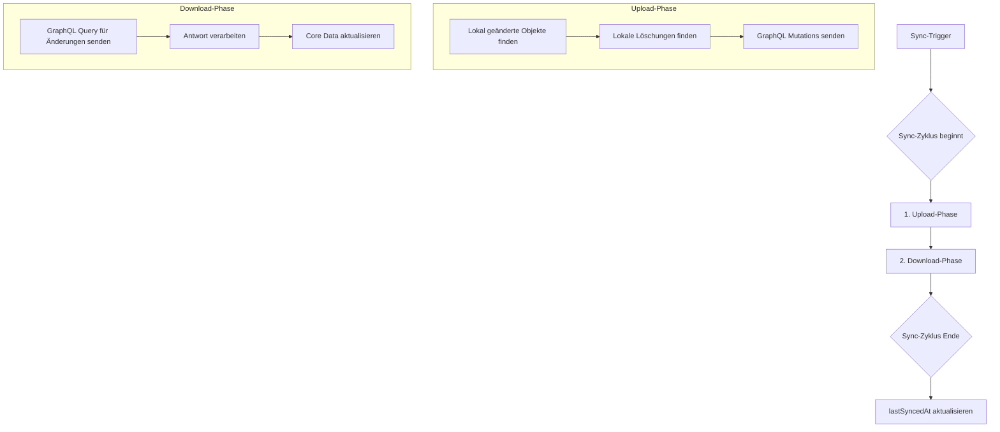

# Architektur für die Synchronisation

Dieses Dokument beschreibt die vorgeschlagene Architektur zur Implementierung der Datensynchronisation zwischen der iOS-App "Journiary" und dem Self-Hosted Backend.

## 1. Übersicht

Ziel ist es, den Benutzern eine nahtlose Erfahrung über mehrere Geräte (z.B. iPhone und iPad) hinweg zu ermöglichen. Auf einem Gerät erstellte oder geänderte Daten (Reisen, Erinnerungen, etc.) sollen nach einer Synchronisation auf allen anderen Geräten desselben Benutzers verfügbar sein. Die Synchronisation erfolgt ausschliesslich über die existierende GraphQL API des Backends.

## 2. Kernkonzepte

Die Architektur basiert auf den folgenden fundamentalen Prinzipien:

### 2.1. Inkrementelle Synchronisation
Um die Netzwerkauslastung und den Batterieverbrauch zu minimieren, wird eine inkrementelle ("delta") Synchronisation implementiert. Anstatt bei jedem Vorgang alle Daten auszutauschen, sendet der Client einen `lastSyncedAt`-Zeitstempel an den Server. Der Server antwortet mit allen Datensätzen, die seit diesem Zeitpunkt erstellt oder geändert wurden.

### 2.2. UUID als "Source of Truth"
Jeder Datensatz (Trip, Memory, etc.) wird durch eine universell eindeutige ID (`UUID`) identifiziert. Diese ID wird bei der Erstellung auf dem Client generiert und bleibt über die gesamte Lebensdauer des Objekts unverändert, sowohl auf dem Client als auch auf dem Server. Dies verhindert Duplikate und ermöglicht eine zuverlässige Referenzierung.

### 2.3. "Last-Write-Wins" Konfliktlösung
Wenn ein Datensatz auf zwei Geräten quasi gleichzeitig geändert wird, bevor eine Synchronisation stattfinden konnte, tritt ein Konflikt auf. Als grundlegende Strategie zur Konfliktlösung wird "Last-Write-Wins" verwendet. Der Datensatz mit dem neueren `updatedAt`-Zeitstempel überschreibt den älteren. Dies ist ein einfacher und robuster Mechanismus für die meisten Anwendungsfälle in diesem Projekt.

### 2.4. Zentraler `SyncManager`
Die gesamte Synchronisationslogik wird in einer zentralen Klasse innerhalb der iOS-App gekapselt: dem `SyncManager`. Dieses Singleton ist verantwortlich für:
- Die Kommunikation mit der GraphQL-API.
- Das Triggern von Synchronisationszyklen.
- Das Mapping zwischen den Core Data Modellen und den GraphQL-Antworten.
- Die Ausführung der Upload- und Download-Phasen.
- Die Handhabung von Fehlern und Konflikten.

## 3. Voraussetzungen & Modell-Anpassungen

### 3.1. Benutzerauthentifizierung
Eine Synchronisation ist an einen Benutzer gebunden. Die App muss einen sicheren Login-Mechanismus implementieren (z.B. E-Mail/Passwort). Nach erfolgreicher Anmeldung erhält der Client ein Authentifizierungstoken (z.B. JWT), das bei jeder API-Anfrage mitgesendet wird, um den Benutzer zu identifizieren.

### 3.2. Anpassungen am Core Data Modell
Das bestehende Core Data Modell muss erweitert werden, um die Synchronisation zu unterstützen. Jede zu synchronisierende Entität (z.B. `Trip`, `Memory`) benötigt die folgenden zusätzlichen Attribute:

- `createdAt` (Date): Zeitstempel der Erstellung. Wird vom Backend gesetzt und zum Client synchronisiert.
- `updatedAt` (Date): Zeitstempel der letzten Änderung. Essentiell für die "Last-Write-Wins"-Strategie.
- `isSynced` (Boolean): Ein Flag, das anzeigt, ob ein Objekt bereits einmal erfolgreich mit dem Server synchronisiert wurde. Neue Objekte haben hier `false`.
- `syncStatus` (String): Ein Enum-artiges Feld zur Verwaltung des Zustands während eines Sync-Zyklus (z.B. `local_only`, `in_sync`, `needs_upload`).

## 4. Der Synchronisations-Zyklus

Ein Synchronisations-Zyklus kann manuell vom Benutzer (z.B. Pull-to-Refresh) oder automatisch (z.B. beim App-Start, im Hintergrund) ausgelöst werden.

### 4.1. Phase 1: Upload (Client → Server)
1.  **Lokale Änderungen erkennen:** Der `SyncManager` durchsucht die lokale Core Data Datenbank nach allen Objekten, deren `updatedAt`-Zeitstempel neuer ist als der `lastSyncedAt`-Zeitstempel.
2.  **Löschungen behandeln:** Gelöschte Objekte müssen speziell behandelt werden. Anstatt sie sofort aus der lokalen DB zu entfernen, werden sie in einer separaten Tabelle (`PendingDeletions`) mit ihrer UUID vorgemerkt. Im Upload-Schritt wird für jede dieser UUIDs eine `delete`-Mutation an den Server gesendet.
3.  **Mutationen ausführen:** Für jedes neue oder geänderte Objekt wird die entsprechende GraphQL-Mutation (`createTrip`, `updateMemory`, etc.) aufgerufen. Dies geschieht in Batches, um die Anzahl der Netzwerk-Requests zu reduzieren.

### 4.2. Phase 2: Download (Server → Client)
1.  **Änderungen abfragen:** Der Client sendet eine GraphQL-Query an den Server (z.B. `syncQuery`) und übergibt den `lastSyncedAt`-Zeitstempel.
2.  **Server-Antwort:** Der Server retourniert eine Liste aller Objekte, die seit diesem Zeitstempel auf dem Server erstellt oder geändert wurden. Er inkludiert auch eine Liste von UUIDs für Objekte, die gelöscht wurden.
3.  **Core Data aktualisieren:** Der `SyncManager` iteriert durch die Antwort:
    - **Neue Objekte:** Wenn ein Objekt mit einer unbekannten UUID ankommt, wird ein neues Core Data Objekt erstellt.
    - **Geänderte Objekte:** Wenn ein bekanntes Objekt ankommt, vergleicht der Client den `updatedAt`-Zeitstempel des Server-Objekts mit dem des lokalen Objekts. Ist der Server-Zeitstempel neuer, werden die lokalen Daten überschrieben.
    - **Gelöschte Objekte:** Für jede vom Server gemeldete gelöschte UUID wird das entsprechende Objekt aus der lokalen Core Data Datenbank entfernt.

### 4.3. Phase 3: Finalisierung
Nachdem beide Phasen erfolgreich und ohne Fehler abgeschlossen wurden, speichert der Client den Zeitstempel des Beginns des Sync-Zyklus als neuen `lastSyncedAt`-Wert.

## 5. Handhabung von grossen Dateien (Medien & GPX)

Die Synchronisation von Binärdateien erfolgt in einem zweistufigen Prozess, um den Haupt-Sync-Zyklus nicht zu blockieren:

1.  **Metadaten-Sync:** Die Metadaten-Objekte (`MediaItem`, `GPXTrack`) werden im normalen Sync-Zyklus synchronisiert. Sie enthalten keine Binärdaten, sondern nur Referenzen (`objectName`/`s3Key`).
2.  **Asynchroner Datei-Transfer:**
    - **Upload:** Für ein neues `MediaItem` fordert der Client über eine GraphQL-Mutation eine "Presigned Upload URL" vom Backend an. Mit dieser URL lädt die App die Datei direkt in den Objektspeicher (MinIO).
    - **Download:** Um ein `MediaItem` anzuzeigen, dessen Binärdaten noch nicht lokal vorhanden sind, wird über eine GraphQL-Query eine "Presigned Download URL" angefordert. Die Datei wird heruntergeladen und lokal gecached.

## 6. Fehlerbehandlung & Robustheit
Der `SyncManager` muss robust gegenüber Netzwerkfehlern sein. Jeder Sync-Zyklus sollte atomar sein. Wenn ein Schritt fehlschlägt (z.B. der Upload), wird der gesamte Zyklus abgebrochen und der `lastSyncedAt`-Zeitstempel wird **nicht** aktualisiert. Dies stellt sicher, dass beim nächsten Versuch die fehlgeschlagenen Änderungen erneut verarbeitet werden. 